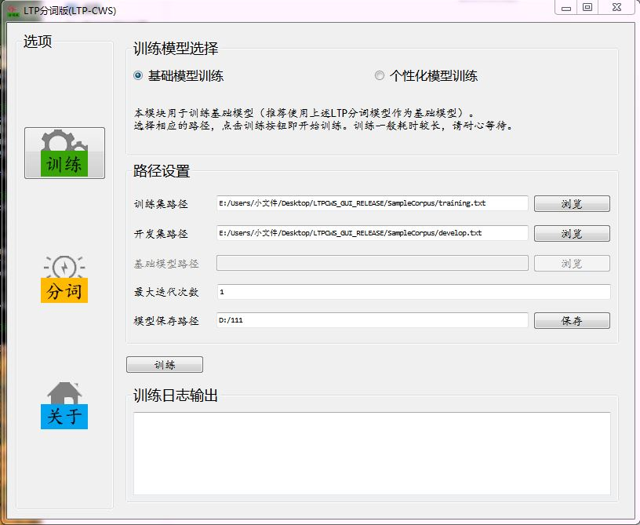
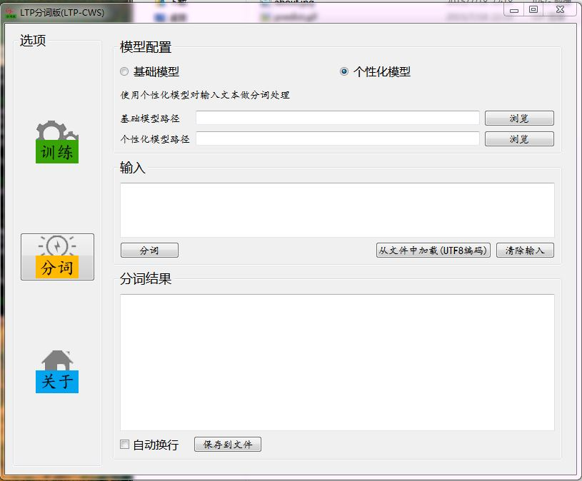
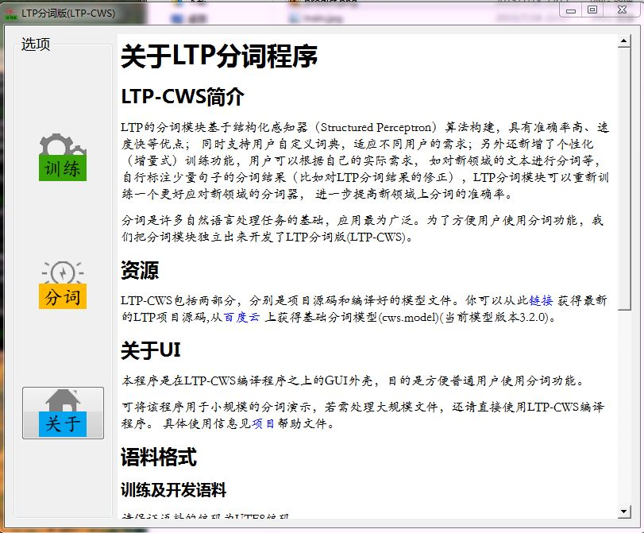

### LTPCWS GUI QT version

重做LTP分词版的前端UI。

####功能

模型训练（基础模型、个性化模型）

分词（使用基础模型、个性化模型）

####项目结构

`/src`  ―― 包含QT项目源代码

`/PS_RES` ―― 其中用到的图片的PS源文件

`/deploy` ―― 发布部署的一些细节

`/screenshot` ―― 截图

####图示

#####训练

#####分词预测

#####关于

